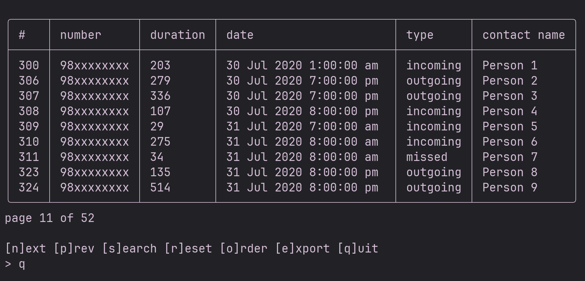

## call history viewer

a simple text based TUI to view call history. basically takes it in XML
export of call logs of a specific format and presents the information in
respective UI

#### usage

just run `python main.py`. it will ask for the path to the xml file and after
that you will be presented with a TUI similar to below.

